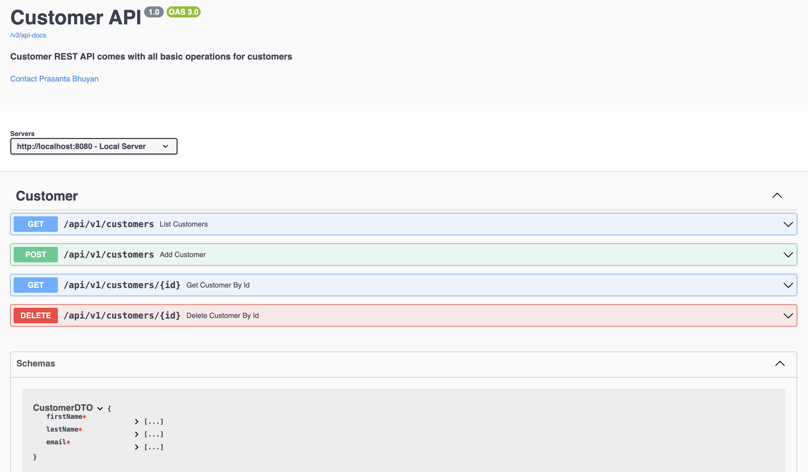

## SpringDoc OpenAPI 

This is a sample application to illustrate how to follow all API documentation best practices 
and provide Swagger UI using SpringDoc OpenAPI

### Getting Started

❯ mvn clean validate

❯ mvn spring-boot:run

http://localhost:8080

